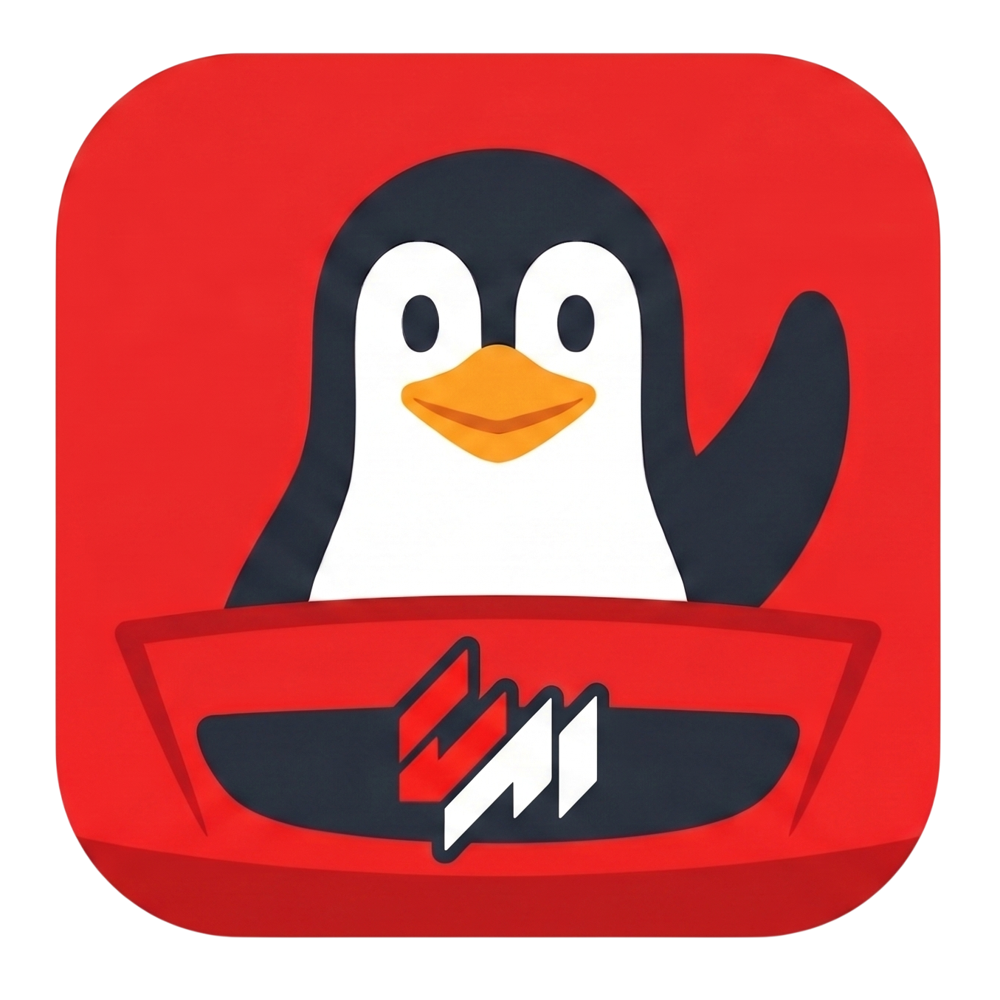

<div align="center">
  
  <h1>Assetto Server Panel</h1>
  <p>A web-based administration panel for <strong>Assetto Corsa</strong> dedicated servers on Linux</p>

  <p>
    <a href="CHANGELOG.md"></a>
    <a href="ROADMAP.md"></a>
    <a href="ROADMAP.md#status"></a>
    
    
  </p>
  <p>
    
    
    
    
    
    
  </p>
</div>

---

## What is it?

A full web interface to manage your Assetto Corsa server without touching the terminal. Accessible from any device on your network, or from anywhere in the world using Cloudflare Tunnel.

---

## Features

### 📊 Real-time monitoring
Live server metrics (CPU, RAM, uptime), AC server status, and a real-time log stream — all updated instantly via Server-Sent Events. Admin-only **persistent "Clear logs"** drops the in-memory buffer AND truncates `AC_LOG_FILE` on disk, then broadcasts an SSE `clear` event so every open tab wipes in lock-step — refreshing the page no longer brings the lines back. Activity card resolves car model IDs to their catalogue display name (`Toyota AE86` instead of `ks_toyota_ae86`).

### 🏎️ Player management
Live player table with car, lap count, best/last time and country flag. Kick and ban directly from the panel. Full history of every player who has ever joined the server. **Per-player admin-set nicknames** — pencil button in the history table opens a modal to attach a real name to an in-game alias; the panel then renders rows as "Nickname (in-game)" everywhere, including historic lap times.

### ⏱️ Lap times database
Every lap time stored in SQLite automatically. **Live ingest via UDP plugin** — laps land in the database within milliseconds of crossing the finish line, no waiting for the session-end JSON dump. The panel auto-configures `UDP_PLUGIN_LOCAL_PORT` and `UDP_PLUGIN_ADDRESS` in `server_cfg.ini` on the first session apply (zero manual setup). Cross-source dedup via a content-based UNIQUE INDEX prevents the post-session JSON importer from duplicating laps the UDP listener already captured; the JSON instead fills in sector splits on those rows.

Three views: **Records** (best lap per driver+track), **All laps** (every row, paginated 10/page) and **Compare drivers** (side-by-side delta table for up to 4 drivers). Filter by track, car, date or validity. CSV export. **Manual lap insert** — admin-only "Add lap" popup writes directly into the same `laps` table the UDP listener uses (shared dedup index, `lap.create` audit entry, Discord-record notification reused), so a missed lap from a server outage or an external timing source can be backfilled without touching SQLite by hand.

### 🚗 Cars & tracks catalogue
Browse all installed cars and tracks with images, specs and multi-layout support. Separate **Kunos content** / **Mod content** toggles — the Kunos toggle auto-flips off on first load when mods are present so modded servers don't drown the catalogue in stock content. Spinner-overlay on each thumbnail with fade-in once fully loaded, so heavy mod previews don't paint in visible chunks. **Per-slot skin selection**: the modal's "Add to slot" passes the selected skin to a `slots` array in session config — the same car can occupy multiple grid positions with different liveries (e.g. FK2 blue + FK2 red as two distinct slots), each landing as its own `[CAR_n]` block in `entry_list.ini`. **Admin-only "Delete" button** inside each modal removes the mod car/track folder recursively from `/content/{cars,tracks}` (audited as `car.delete` / `track.delete`); Kunos content is hard-refused server-side and the button is hidden for it, so the bundled DLC catalogue stays intact and continues serving as the asset-fallback source for the rest of the panel.

### 🏁 Session planner
Per-session (Practice / Qualify / Race) enable toggles — when a session is disabled the panel physically removes its section from `server_cfg.ini` so `LOOP_MODE` only cycles the enabled ones. Independent duration/laps per session, weather and air temperature, time of day (hour 0..23 mapped to `SUN_ANGLE`), race penalties toggle. The `entry_list.ini` is regenerated automatically whenever the car set changes so `acServer` never refuses to boot on a stale `[CAR_n].MODEL` reference.

### 📦 Mod installer
Upload mods as `.zip`, `.rar` or `.7z` straight from the browser. The server automatically detects whether it's a car or a track and installs it in the right folder. Works remotely too, with chunked upload support for Cloudflare and other proxies.

### ⚙️ Server configuration
Edit `server_cfg.ini` through a visual interface: server name, ports, slots, passwords (with show/hide toggle), driving aids, whitelist and more. Race-rule and behaviour options persist correctly even at value `0`. **Country + city selector** writes a `[GEO_PARAMS]` section in the canonical `"<Name>, <ISO2>"` format Content Manager and the acstuff lobby read to render the server flag — the panel creates the section on first save and leaves `IP=` blank so the lobby fills it from the registration packet (so dynamic-IP / NAT setups don't end up advertising a stale address). Requires an `acServer` restart to reach the lobby, same as any other `server_cfg.ini` change.

### 👥 User management
Create, edit and delete panel users. Each user has their own profile with password change and a built-in secure password generator (uses `crypto.getRandomValues`). The panel refuses to delete *or demote* the last remaining admin and revokes a user's active sessions when an admin resets their password.

### 🔐 Granular role permissions
The `user` role is gated by nine independent toggles edited from the **Users** page: `serverControl`, `sessionEdit`, `serverConfig`, `whitelistManage`, `playerModeration`, `modUpload`, `discordWebhook`, `auditView`, `dbBackup`. Admin always passes every check. Defaults preserve the open grants from earlier deployments (server control / session edit / mod upload on; the rest off). Editing a permission takes effect on the affected user's next request — no re-login needed. Panel-user CRUD, AC `PASSWORD` / `ADMIN_PASSWORD` and the permission set itself are reserved to admins by design (cannot be exposed as toggles without enabling privilege escalation).

### 🔔 Discord notifications for lap records
Drop a Discord webhook URL into Settings → Discord; the server posts a localized message every time a driver beats the previous best lap for a `(track, layout, car)` combination on the live UDP path. First-ever lap on a combo is **not** a record, so opening up new content doesn't spam the channel. The message uses the panel language stored server-side (en/es/it) and resolves track/car to their catalogue display names. Webhook URL is treated as a secret — never returned to non-admins / users without the `discordWebhook` permission.

### 🛡️ Security
- **Sessions:** scrypt password hashing with cost params pinned in `SCRYPT_PARAMS` (constant-time compare), `HttpOnly; SameSite=Strict` cookies with 7-day TTL plus the `Secure` flag when the request arrived over HTTPS, automatic 401 → logout interceptor on the client.
- **Forced first-login change:** seeded `Admin / Admin1234!` is locked into a blocking modal until the password is changed; server-side gate refuses every authenticated endpoint until the flag clears.
- **CSRF:** unsafe methods require `Origin`/`Referer` to match `Host`; combined with `SameSite=Strict` cookies, cross-site requests are rejected at two layers.
- **Headers:** CSP, Permissions-Policy, X-Frame-Options, Referrer-Policy on every response. HSTS auto-enabled when behind an HTTPS-terminating proxy.
- **Rate-limited** login, change-password, mod uploads, server start/stop/restart and config writes. Per-user concurrent SSE log-stream cap (6) caps file-descriptor usage. Optional `TRUST_PROXY=1` to honour `CF-Connecting-IP` / `X-Forwarded-For` so the limiter sees real client IPs through Cloudflare.
- **`ADMIN_TOKEN`** header (when configured) is compared in constant time via `crypto.timingSafeEqual` to avoid byte-by-byte timing oracles.
- **Mod uploads:** strict zip-slip abort, archive entry-count and aggregate-size caps, INI value sanitisation against injection.
- **Per-user audit log** of every admin action, with cursor pagination. Rows are SHA-256 hash-chained with a JSON-canonicalised payload (`chain_version = 1`) so a `|` inside a field cannot collide with a different field assignment; legacy rows still validate.

### 📱 Responsive
Sidebar collapses into a drawer with a hamburger toggle below 900 px wide; layouts re-flow to single columns on phones. Tested on portrait phones down to 360 px.

### 🌍 Multilingual
Full interface available in **English**, **Spanish** and **Italian**.

---

## Quick start

```bash
git clone https://github.com/ayozetr/assetto-dashboard.git
cd assetto-dashboard
nvm use 20.20.2
npm install
cp .env.example .env   # fill in your server paths
npm start              # automatically pre-builds dist/ via esbuild then runs server.js
```

The first time you run `npm start`, esbuild transpiles `src/*.jsx` to `dist/*.js`. Subsequent starts re-build (it takes ~20 ms — much cheaper than transpiling in the browser on every page load like before).

To rebuild manually after editing JSX without restarting the server:
```bash
npm run build
```

Open `http://<server-ip>:3000` in your browser.

> ### ⚠️ Before exposing the panel beyond `localhost`
>
> The default `HOST=0.0.0.0` listens on **every** network interface. Combine that with the wrong network config and the panel becomes reachable from places you didn't intend. Pick one of:
>
> 1. **Cloudflare Tunnel (recommended).** Set `HOST=127.0.0.1` and `TRUST_PROXY=1` in `.env`. The tunnel terminates TLS and forwards traffic to localhost; no firewall ports are opened. See [docs/deployment.md](docs/deployment.md#cloudflare-tunnel-remote-access-without-port-forwarding).
> 2. **LAN-only access.** Leave `HOST=0.0.0.0` but **block port 3000 from the internet** at the router / firewall. Do **not** set `TRUST_PROXY=1` — without a real proxy in front it lets any LAN client spoof their IP in `CF-Connecting-IP`. (Mitigated by an IP allowlist in 1.5+ but still operator error worth avoiding.)
> 3. **Reverse proxy (nginx / Caddy / Traefik).** Same shape as Cloudflare Tunnel: `HOST=127.0.0.1` + `TRUST_PROXY=1` + `TRUST_PROXY_FROM=<proxy IP CIDRs>` in `.env`.
>
> If the panel is publicly reachable you **must** change the default `Admin` password (the first login forces it, but a port scanner can still see the login screen). Consider also adding Cloudflare Access / Tailscale / a VPN as a second factor.

**Default credentials:** `Admin` / `Admin1234!`. The first login forces a password change in a blocking modal — the rest of the panel is unreachable (server-side enforced) until the password is changed. If you ever lock yourself out, run:

```sql
UPDATE panel_users SET must_change_password = 0 WHERE username = 'Admin';
```
in the SQLite DB and log in normally.

---

## Documentation

| Document | Description |
|----------|-------------|
| [AC server setup (SteamCMD)](docs/ac-server-setup.md) | Install and configure an AC dedicated server from scratch |
| [Installation & configuration](docs/installation.md) | Requirements, setup steps and environment variables |
| [Docker deployment](docs/docker.md) | Containerised setup with `docker compose up -d`, volumes, networking, reverse-proxy front-end, troubleshooting |
| [Production deployment](docs/deployment.md) | Systemd service, Cloudflare Tunnel, firewall, log rotation, hardened systemd unit |
| [Authentication & users](docs/authentication.md) | Session system, roles and user management |
| [Mod installer](docs/mod-upload.md) | Supported formats, auto-detection, chunked upload |
| [Database](docs/database.md) | SQLite schema and what gets stored |
| [API reference](docs/api.md) | All server endpoints |
| [Troubleshooting](docs/troubleshooting.md) | Common issues and how to fix them |
| [Tools](docs/tools.md) | Scripts for extracting and compressing bundled Kunos assets |
| [Security policy](SECURITY.md) | How to report vulnerabilities and what is in / out of scope |
| [Roadmap](ROADMAP.md) | Project status, comparison with ACSM / Stracker, prioritized backlog |
| [Changelog](CHANGELOG.md) | Per-release summary of every notable change since 1.0.0 |

---

## Threat model

This is a **single-tenant admin tool**, not a multi-tenant web app. Trust assumptions:

- **Admins are fully trusted.** Admin role always passes every permission check. Exclusively allowed actions: managing panel users (create / delete / change role / reset password), editing the AC server `PASSWORD` and `ADMIN_PASSWORD` fields, wiping mod history, downloading the SQLite DB and reading or writing the role-permissions set itself. These are reserved by design — exposing them as toggles would let a `user` escalate to admin.
- **The `user` role is configurable per-permission, not "read-only".** An admin can grant a user the ability to start/stop the AC server, edit `server_cfg.ini` (everything except the two AC passwords), apply session changes, kick/ban drivers, manage the whitelist, upload mods, edit the Discord webhook, view the audit log and download DB backups — one toggle each. Trust accordingly: granting `serverConfig` lets the user reshape the running server; granting `modUpload` lets the user push arbitrary code that runs inside the AC server process (there is **no sandbox** between mods and the host).
- **Do not expose the panel to the public internet without HTTPS and credentialled access.** Do not give panel accounts to anyone you would not trust with the equivalent shell-level capability. Always set `TRUST_PROXY=1` when behind Cloudflare/Tunnel/reverse-proxy so rate limits and audit logs see real client IPs.
- **The audit log is hash-chained but deletable.** Each row stores a SHA-256 of the previous row's hash, so silent edits are detectable with `node tools/verify-audit.js` against an external backup. Anyone with shell access to `assetto.db` can still wipe rows entirely — keep periodic backups via `/api/admin/backup` if you need provable history. Every permission-gated action is recorded with the actor's username, so a per-user trail survives even when a permission set is broad.

What the panel **does** defend against:
- Anonymous attackers (CSRF, brute-force on login, path traversal, INI injection, decompression bombs, malformed archives).
- Privilege escalation from a compromised user account — even with every toggle on, the user role cannot create/delete panel users, change another user's role or password, read the AC server `PASSWORD` / `ADMIN_PASSWORD`, wipe mod history, or edit the role-permissions set.
- Stolen old SW caches (network-first navigation strategy ensures security fixes propagate without manual cache bumps).

What the panel does **not** defend against:
- Malicious mods (no sandboxing — only grant `modUpload` to people you trust to vet upload sources).
- A compromised admin account (full control by design).
- An over-permissioned user account — e.g. a user granted `serverConfig` can rewrite ports, ban-list flags and rules; a user granted `modUpload` can ship arbitrary native code. Defaults exist; the *configured* permission set is the operator's responsibility.
- Filesystem access via the host shell or other services.

---

## Tech stack

- **Frontend:** React 18 (production CDN) + esbuild build step transpiling JSX → plain JS at startup
- **Backend:** Node.js native HTTP (no Express)
- **Database:** SQLite via `better-sqlite3`
- **Mod extraction:** `node-stream-zip`, `node-unrar-js`, `node-7z`
- **Real-time logs:** Server-Sent Events (SSE)

---

## License

Source-available. The full text — which is what binds you, not this summary — is in [`LICENSE`](LICENSE). Read it before deploying.

Short version (informative, not legally operative — only the LICENSE file is):

- **Free to download and run anywhere, for anything lawful.** Personal hobby use, private leagues, friend groups, amateur clubs, educational and research use are all fine. So is operating the panel for **public servers**, including servers advertised on the Kunos public-server list / Content Manager lobbies, **including commercial use** (paid leagues, sponsorships, ads, donations, for-profit organizations). You don't need a separate agreement to charge for participation or run a paid event on top of a server the panel manages.

- **No redistribution.** You may not republish the source code, fork it to a public repository as your own, upload it to a package registry, bundle it into another product, host it as a service for third parties to download, or otherwise hand copies to other people. If someone wants to use the panel, point them at the official repository — they can clone it themselves under their own acceptance of the LICENSE.

- **Attribution Marks are irremovable.** The "Developed by ayozetr" credit in the sidebar, the project name "Assetto Server Panel", the link to the official repository, the copyright notice, and every other identifier referring to the author or the project **must stay intact** in every copy you operate. This applies even to commercial deployments. A re-skin, white-label, or theme that hides the marks is a breach and terminates your rights automatically.

- **Local modifications are allowed.** Patch bugs, translate, add integrations, restyle (without touching the Attribution Marks) — keep them for yourself. You may submit them upstream via pull request; you may not publish them as your own fork.

- **No affiliation with anyone.** Not Kunos Simulazioni, not Valve, not 505 Games, not the Content Manager / acstuff projects, not any car / track manufacturer whose brand appears in bundled assets. The LICENSE has a long disclaimer section spelling this out.

- **No warranty, no liability.** "AS IS". Each tagged release is published with good-faith effort against known vulnerabilities at the time of publication, but the author makes no ongoing warranty and accepts no liability for damages, data loss, or downtime. See LICENSE sections 7 and 8.

For licensing questions, redistribution requests, or anything else: **`ayozetr@proton.me`**. For security disclosure see [`SECURITY.md`](SECURITY.md).
